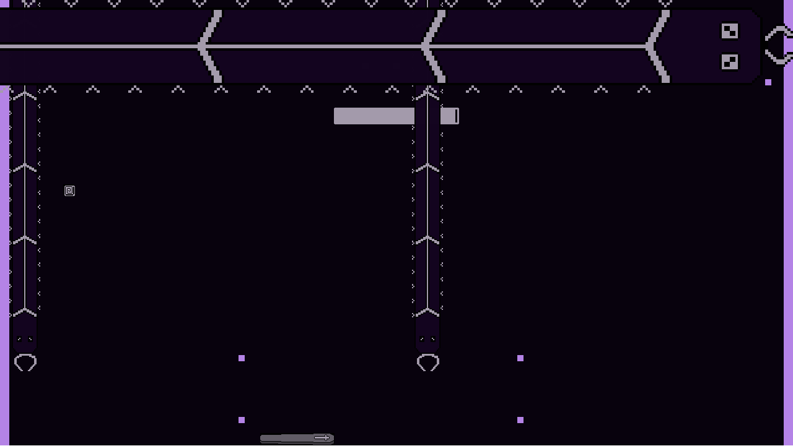
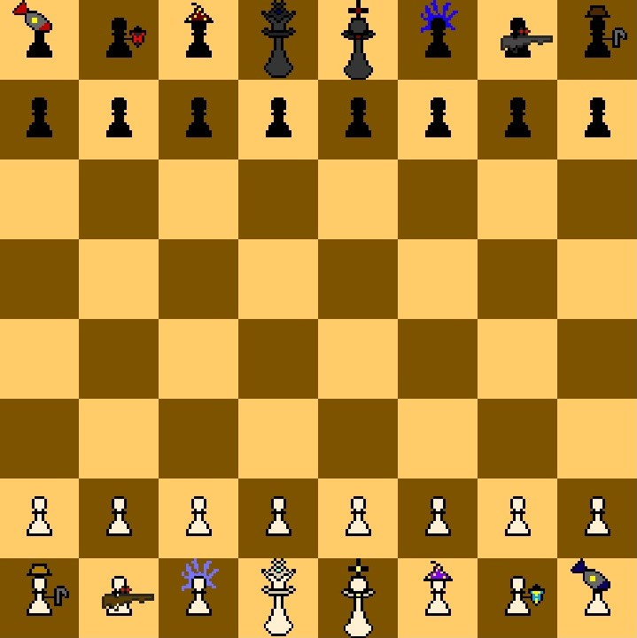
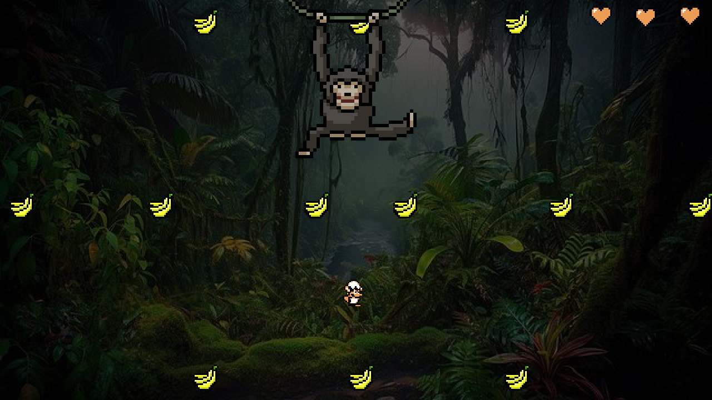
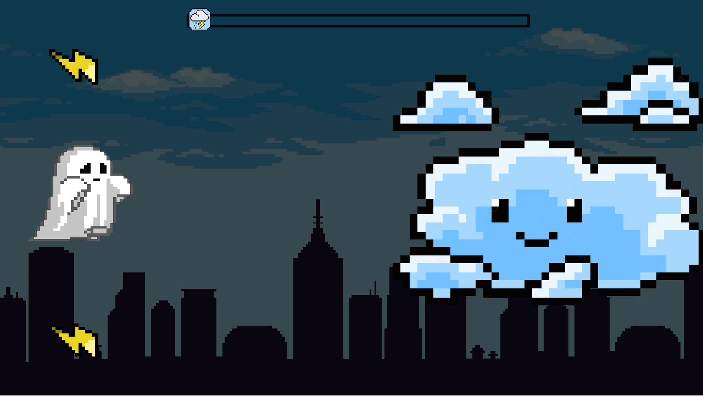

<h1 align = "center">Hi, I'm Alejandro 👋</h1>

<tr>
<td width="50%">
<h3 align="center">Bouncy Tomb</h3>

Videogame in which you have to hit the ball to break all the blocks and get out of hell. ❤️Be careful, you only have three lives!!! 👾6 levels, 2 bonus levels and 2 bosses. 😄Play and have fun. 💻Code and images by Zero2680. 🎧Music by Pixabay.

 
                                                                                      
</td>

<td width="50%">
<h3 align="center">Ajedrez 2</h3>

Different type of chess with new pieces: 🔫 Sniper: kill the piece in front of him // 🧊Ice: freeze a random enemy piece for 4 turns // 🧙🏻‍♂️Wizard: exchange positions of two random pieces // ⚓Hook: attracts the piece in front of him // 💣Bomb: after 4 moves, it explodes //🛡️Shield: creates three shields that block other abilities

</table>

<table>
<tr>
<td width="50%">
<h3 align="center">Ducky</h3>

Challenging 2D action game where you step into the feathers of a brave duck 🦆 who must face waves of attacks while dodging and battling against dangerous bosses 😈. Will you be able to defeat the bosses and save your home, or will you fall in the attempt? 

                                                                                      
</td>

<td width="50%">
<h3 align="center">Nuss</h3>

Videogame in which you must dodge attacks to defeat the different bosses: The Cloud 🌩️, The Sun ☀️, The Moon 🌙 and... The Final Boss 👽! You only have three lives so be careful! ❤️ Play and have fun! 😃 Code and images by Zero2680.

</td>
</table>

 

### ⚙️ &nbsp;GitHub Analytics

